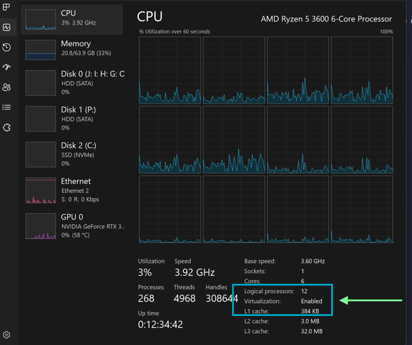
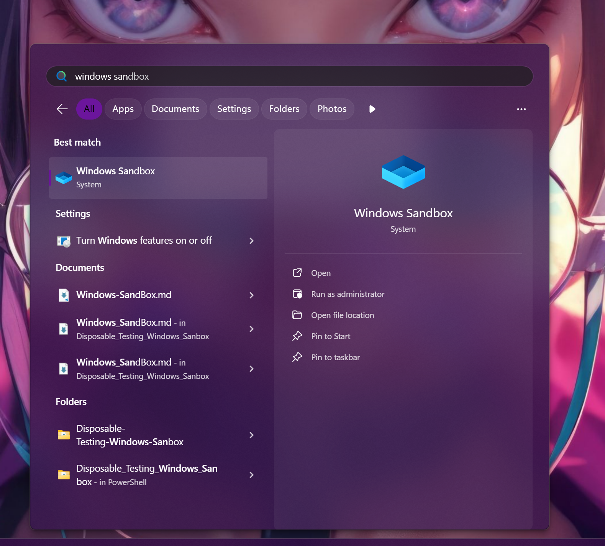
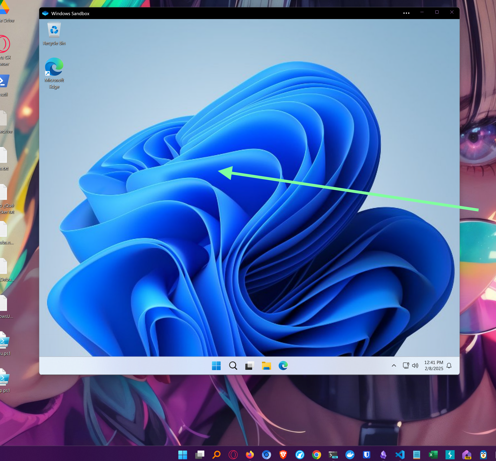

# Automatización de Contenedores en Windows 11 con Windows Sandbox

## Introducción

Este proyecto tiene como objetivo automatizar el despliegue de contenedores en Windows 11 utilizando **Windows Sandbox (WSB)**. La configuración del entorno se realizará mediante plantillas de WSB y el gestor de paquetes **Winget** para instalar todas las aplicaciones y lenguajes de programación necesarios. Esto permitirá a los usuarios experimentar con código, aprender sobre modelos de lenguaje (LLM's) y explorar la automatización del setup y configuración de entornos.

## ¿Qué es Windows Sandbox?

Windows Sandbox es una funcionalidad integrada en Windows 10 y Windows 11 que permite ejecutar un entorno aislado y temporal. Es ideal para pruebas, experimentación y ejecución de aplicaciones sin afectar el sistema principal.

### Ventajas de Windows Sandbox

1. **Parte del ecosistema de Windows**: No requiere instalación de software adicional, solo habilitar una característica del sistema.
2. **Fácil de habilitar**: Se activa desde la configuración de Windows en pocos pasos.
3. **Ligero**: Usa una imagen limpia del sistema operativo y optimiza el uso de recursos.
4. **Aislado**: Todo lo que ocurre en el sandbox no afecta al sistema host.
5. **Efímero**: Una vez cerrado, todo el entorno se elimina, dejando el sistema limpio.
6. **Reproducible**: Se pueden definir configuraciones específicas mediante archivos `.wsb`, permitiendo crear entornos personalizados y repetibles.

## ¿Qué es Winget?

**Winget** (Windows Package Manager) es una herramienta de línea de comandos desarrollada por Microsoft para la gestión de paquetes en Windows. Permite instalar, actualizar y configurar aplicaciones de manera automatizada y eficiente.

### Ventajas de Winget

1. **Automatización**: Facilita la instalación y configuración de múltiples aplicaciones con un solo comando.
2. **Estandarización**: Garantiza que todos los entornos tengan las mismas herramientas y versiones de software.
3. **Integración con Windows**: No requiere instalación adicional en Windows 10 y 11, ya que es parte del sistema.
4. **Velocidad y eficiencia**: Reduce el tiempo de instalación al eliminar pasos manuales.
5. **Compatible con scripts**: Se puede usar en scripts para despliegues rápidos y automatizados.

### ¿Por qué usar Winget en este proyecto?

Para entornos efímeros como los creados con Windows Sandbox, Winget es la opción ideal porque permite:

- Instalar rápidamente todas las herramientas necesarias en cada nueva instancia del sandbox.
- Mantener un registro estructurado de las aplicaciones instaladas.
- Evitar la necesidad de configurar manualmente cada entorno, garantizando consistencia y reproducibilidad.

## Tecnologías Utilizadas

- **Windows Sandbox (.wsb)**: Para la definición del entorno y asignación de recursos.
- **Winget**: Para la automatización de la instalación de software y herramientas.

## Objetivos del Proyecto

- Crear entornos personalizables y automáticos para experimentación con código.
- Facilitar el aprendizaje de modelos de lenguaje (LLM's) en un entorno seguro.
- Automatizar la configuración y despliegue de software en un entorno efímero o persistente.

## Habilitar, Configurar e Instalar Windows SandBox (WSB)

1) Hay que asegurarse que la opcion de virtualizcion esta hablida en la Bios de nuestra maquina

> **INFO:**
> Para Comprobarlo tan solo hay que hay abrir el administrador de Tarea de Windows,
> Selecinar la pestana de Rendimiento/Performance y dar click en CPU. En la parte
> inferior derecha indicara si esta o no habilitada:

<br>



<br>

2) Ahora hay que habilitar la capacidad de contenedores desechables que windows tiene,
abriendo PowerShell como Adminstrador hay que ejecutar el siguiente comando:

<br>

```powershell
Enable-WindowsOptionalFeature -FeatureName "Containers-DisposableClientVM" -All -Online -NoRestart
```

<br>

3) Aun que en el comando anterior le indique al sistema que no queria Reinciarlo
con el flag `-NoRestart` , lo correcto y para un mejor funcionamiento del entorno
es reiniciar, asi que guardando todo lo que no se haya guardado, reiniciamos el sistema
4) Ya de nuevo en el sistema, si abrimos el menu de inicio y buscamos "Windows SandBox"
lo encontraremos. Si desea abrirlo adelante:

<br>



<br>

## Windows SandBox Desplegado



<br>

## Winget Package Manager

Para instalar todo lo que necesite cada plantilla el gesto de paquetes Winget tiene que estar instalado
en el host (tu maquina) y en el huesped (Contenedor Windows SandBox).

Winget tiene la extensibilidad de usar el formato `XML` como un manifiesto de instrucciones se les conoce por
archivos "XAML" (se pronuncia Zaml). Su al igual que el Mark Down, Json, Yml, Yaml y Toml son lenguages de
marcado que se usan mucho como guias, instructivos, manifiestos, registros, entre otras cosas mas. Microsoft
para darle mas identidad a esta plataforma y tecnologia hizo uno nuevo formato de archivo `.wsb` por su nombre
`Windows Sand Box`, pero en si es formato "XML".

> *Ejemplo*
>
> **Configuracion.wsb:**

```xml
<Configuration>
<MemoryInMB>8192</MemoryInMB>
<vGPU>Disable</vGPU>
<Networking>Default</Networking>
<ClipboardRedirection>Disable</ClipboardRedirection>
<MappedFolders>
   <MappedFolder>
     <HostFolder>${env:USERPROFILE}\.wsbf</HostFolder>
     <ReadOnly>true</ReadOnly>
   </MappedFolder>
</MappedFolders>
<LogonCommand>
   <Command>explorer.exe C:\users\WDAGUtilityAccount\Desktop\Downloads</Command>
</LogonCommand>
</Configuration>
```            

## Proximos Pasos

1. Actualizar todo el sistema software, firmware y controladores
2. Asegurar la disponibilidad de Gestor de paquetes winget
3. Generar las diferent4es plantillas
4. Ubicar las plantillas en un lugar en donde el contenedor tenga permisos
para leerlar y ejecutar la lista de comandos y tareas para el auto despliegue
5. Al terminar el contenedor se auto iniciara, todas las aplicaciones estaran instaladas y listo para su uso.

# **Actualizacion software, firmware y controladores**

```powershell
Set-ExecutionPolicy -ExecutionPolicy RemoteSigned -Scope CurrentUser
Set-PSRepository -Name PSGallery -InstallationPolicy Trusted
Install-Module -Name PSWindowsUpdate -Repository PSGallery -Scope AllUsers
Import-Module PSWindowsUpdate -Scope Global
Get-WindowsUpdate -Verbose
Install-WindowsUpdate -AcceptAll -Install -IgnoreReboot -SendReport -Verbose *>&1 | Out-File "${ENV:USERPROFILE}\PSWindowsUpdate.log"
Get-WindowsUpdate -WindowsUpdate -UpdateType Driver -IsInstalled -ShowPreSearchCriteria -Verbose
Install-WindowsUpdate -WindowsUpdate -UpdateType Driver -AcceptAll -Install -IgnoreReboot -SendReport *>&1 | Out-File "${ENV:USERPROFILE}\WindowsUpdate-Drivers.log"
```

# *Asegurar la disponibilidad de Gestor de paquetes winget*

```powershell
Get-Command winget | Select-Object -ExpandProperty Definition
```

## Instalación y Uso

Próximamente se incluirán instrucciones detalladas sobre cómo configurar y utilizar los entornos sandbox con este proyecto.
